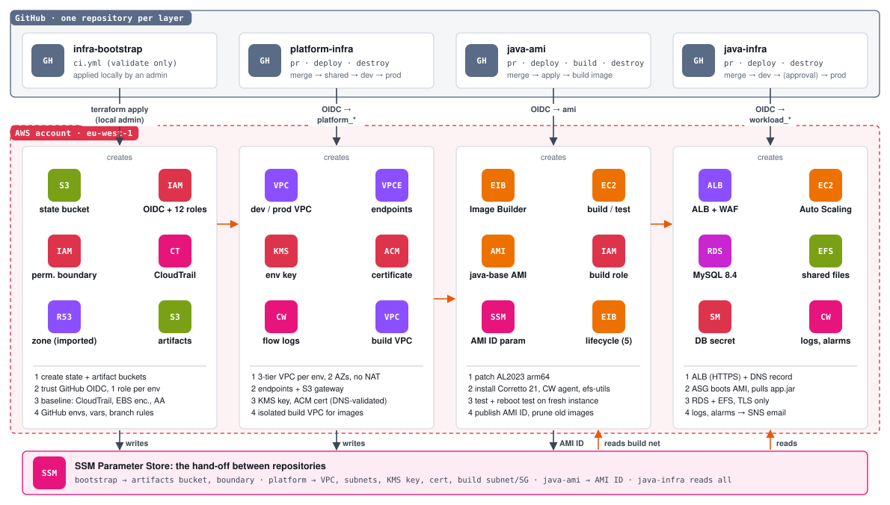

# java-ami

Immutable, patched base AMI for Java services, built by EC2 Image Builder in the
private build VPC from platform-infra. It contains the runtime only: no
application JAR and no environment configuration.

```text
Amazon Linux 2023 arm64 (latest at build time)
  └─ update-linux            AWS managed: OS patches
  └─ java-runtime            Corretto 21 headless, CloudWatch agent, amazon-efs-utils, UTC
  └─ reboot-test-linux       AWS managed test
        │  validate + test phases must pass
        ▼
  AMI java-base-arm64-<date>  ──►  SSM /imagebuilder/java-platform/java-base  ──►  java-infra
```

## Diagrams

### How the four repositories fit together

<picture>
  <source media="(prefers-color-scheme: dark)" srcset="docs/diagrams/repositories.dark.svg">
  
</picture>

Each column is one repository: its workflows, the AWS services it creates, and what happens in it, in order. Repositories hand values to each other only through SSM Parameter Store.

### Image pipeline

<picture>
  <source media="(prefers-color-scheme: dark)" srcset="docs/diagrams/image-pipeline.dark.svg">
  
</picture>

Patch, install and validate on a build instance, snapshot to an AMI, test it on a fresh instance, then publish the AMI ID to SSM. Any failure stops the image.

## Design

| Concern | Decision |
|---|---|
| Architecture | Graviton (arm64): better price/performance; build on `t4g.medium` |
| Patching | Parent image resolved at build time (`x.x.x`); weekly schedule that only runs when the parent image or a component has an update |
| Network | Private build subnet, no internet; AWS reached through VPC endpoints; S3 endpoint restricted to Image Builder, SSM and AL2023 repositories |
| Quality gates | Component `validate` and `test` phases, AWS reboot test, image tests enabled |
| Security | IMDSv2 required, encrypted gp3 root volume, roles created under the platform permissions boundary |
| Distribution | Tagged AMI; latest AMI ID published to SSM `/imagebuilder/java-platform/java-base` (`aws:ec2:image`) for java-infra. The path is fixed by the Image Builder service-linked role, which may only write under `/imagebuilder/` |
| Housekeeping | Lifecycle policy keeps the 5 most recent images (AMIs and snapshots) |

## Changing the image

Image Builder recipes and components are immutable. In the same pull request:

1. Edit `components/java-runtime.yml` and/or `terraform/*.tf`.
2. Bump `component_version` (component changes) and `recipe_version` (any recipe change) in `terraform/terraform.tfvars`.

Merging applies the definition and builds a new image; the workflow fails if the build or any test fails.

## Workflows

| Workflow | Trigger | What it does |
|---|---|---|
| `pr.yml` | Pull request | fmt, validate, tflint, Trivy, read-only plan; `ci` is the required check |
| `deploy.yml` | Merge to `main` | apply, then run `build.yml` |
| `build.yml` | Manual / called | start a pipeline execution and wait for `AVAILABLE` |
| `destroy.yml` | Manual | destroy the pipeline and optionally deregister built AMIs |

Inputs come from SSM (`/java-platform/shared/*`), so platform-infra's shared stack must be applied first.
