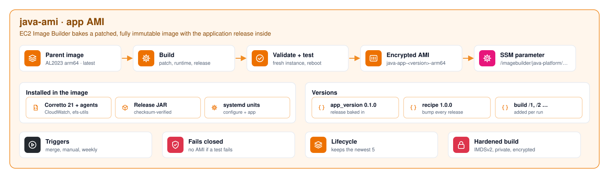

# java-ami

> Part of **[Java Platform](https://github.com/maga-zargaryan/java-platform)** · [infra-bootstrap](https://github.com/maga-zargaryan/infra-bootstrap) → [platform-infra](https://github.com/maga-zargaryan/platform-infra) → **java-ami** → [java-infra](https://github.com/maga-zargaryan/java-infra)
>
> See [java-platform](https://github.com/maga-zargaryan/java-platform) for how the four layers fit together.

Fully immutable application AMI, built by EC2 Image Builder in the private build
VPC from platform-infra. Each image contains everything an instance runs: the
patched OS, Java, the agents **and one release of the application**. Instances
use no user data; at boot they read their environment's settings from SSM
Parameter Store.

```text
Amazon Linux 2023 arm64 (latest at build time)
  └─ update-linux            AWS managed: OS patches
  └─ java-runtime            Corretto 21 headless, CloudWatch agent, amazon-efs-utils, UTC
  └─ java-app                release JAR (checksum-verified), javaapp user, systemd units,
                             boot-time configurator, CloudWatch agent config
  └─ reboot-test-linux       AWS managed test
        │  validate + test phases must pass
        ▼
  AMI java-app-<version>-arm64-<date>  ──►  pinned by AMI ID in java-infra (dev, then promoted to prod)
```

## What happens at boot

No user data. Two baked systemd units run on every new instance:

1. `java-app-configure` reads the instance's `Environment` tag (IMDSv2), fetches
   `/java-platform/<environment>/app/*` from SSM (DB host, secret ARN, EFS IDs, port,
   JVM options, log group), writes `/etc/java-app/app.env`, mounts EFS with TLS and IAM,
   and starts the CloudWatch agent.
2. `java-app` starts the application as the non-root `javaapp` user.

The logic is in the image and tested by the pipeline; only data comes from the environment.

## Diagrams

### Image pipeline

<picture>
  <source media="(prefers-color-scheme: dark)" srcset="docs/diagrams/image-pipeline.dark.svg">
  
</picture>

EC2 Image Builder patches, installs, tests and publishes the AMI; any failed test stops the image.

Diagrams are generated by [`tools/diagrams`](https://github.com/maga-zargaryan/java-platform/tree/main/tools/diagrams) in the java-platform repository.

## Design

| Concern | Decision |
|---|---|
| Architecture | Graviton (arm64): better price/performance; build on `t4g.medium` |
| Patching | Parent image resolved at build time (`x.x.x`); weekly schedule that only runs when the parent image or a component has an update |
| Network | Private build subnet, no internet; AWS reached through VPC endpoints; S3 endpoint restricted to Image Builder, SSM, AL2023 repositories and the artifacts bucket |
| Quality gates | Component `validate` and `test` phases, AWS reboot test, image tests enabled |
| Security | IMDSv2 required, encrypted gp3 root volume, roles created under the platform permissions boundary |
| Distribution | Tagged AMI (`Image`, `AppVersion`, `Architecture`, `Java`, `GitCommit` = the java-ami commit it was built from, `SourceRepo`). No "latest" pointer: java-infra pins each environment to an exact AMI ID |
| Housekeeping | Lifecycle policy keeps the 5 most recent images (AMIs and snapshots) and never deletes an AMI tagged `InUse-dev` or `InUse-prod` |

## Releasing the application

1. Upload `app.jar` and `app.jar.sha256` to `s3://<artifacts>/java-app/<version>/`.
2. In `terraform/terraform.tfvars`, set `app_version` and bump `recipe_version`, then open a pull request.
3. Merge: the pipeline builds and tests a new AMI (about 30 minutes); the run summary shows its AMI ID.
4. In java-infra, set that ID as `ami_id` in `environments/dev/terraform.tfvars` and merge: dev rolls to it.
5. Promote: copy the same `ami_id` into `environments/prod/terraform.tfvars` and merge: prod runs exactly what dev ran.

Rollback means setting `ami_id` back to the previous AMI. AMIs an environment runs are tagged `InUse-<env>` and are never cleaned up.

## Changing the image

Image Builder recipes and components are immutable. In the same pull request, edit the
component YAML and/or `terraform/*.tf`, then bump `component_version` / `app_component_version`
(component changes) and `recipe_version` (any recipe change).

## Workflows

| Workflow | Trigger | What it does |
|---|---|---|
| `pr.yml` | Pull request | fmt, validate, tflint, Trivy, read-only plan (skipped when nothing under `terraform/` or `components/` changed); `ci` is the required check |
| `deploy.yml` | Merge to `main` | apply, then run `build.yml` |
| `build.yml` | Manual / called | start a pipeline execution and wait for `AVAILABLE` |
| `destroy.yml` | Manual | destroy the pipeline and optionally deregister built AMIs |

Inputs come from SSM (`/java-platform/shared/*`), so platform-infra's shared stack must be applied first.
